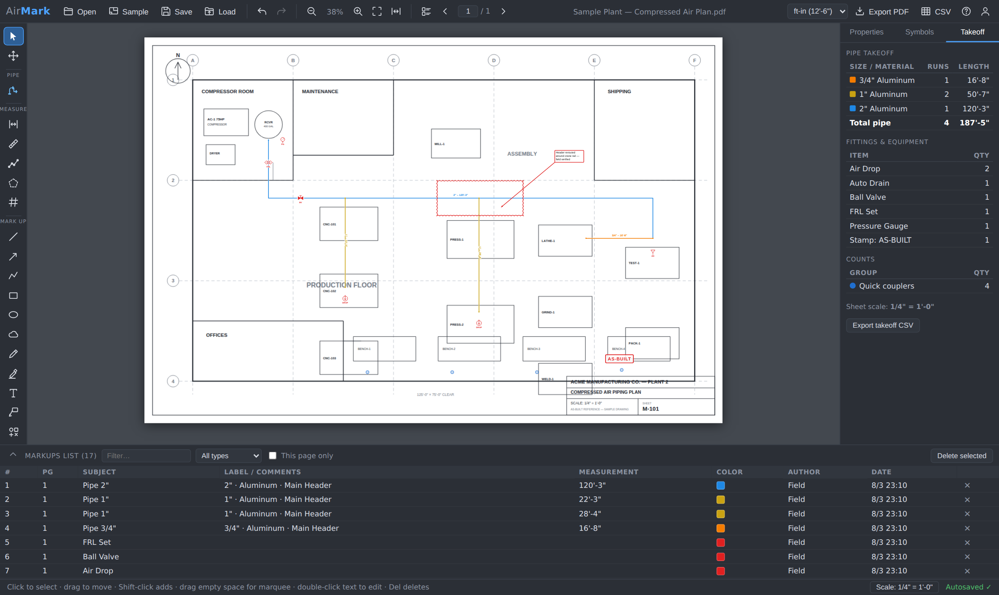

# AirMark — As-Built Markup Tool for Compressed Air Piping

A Bluebeam-style PDF markup and measurement tool built for one job: **marking up site drawings for compressed air pipe work** — routing, sizing, takeoffs, and as-built records — right in the browser.



Everything runs client-side — there is no build, no framework, and drawings stay on the device by default. Two optional connections change that deliberately: the [AroFlo site-stock link](#live-site-stock-aroflo) (inventory queries through a small proxy so API keys stay off the browser) and the [team cloud](#team-cloud-optional--sign-in-shared-projects-drawings-synced) (sign-in, a shared project list, and drawings/markups synced to your own private storage so any employee's device can open any job).

## Quick start

- **Easiest:** open `index.html` in any modern browser (Chrome, Edge, Firefox). It works straight off the disk.
- **Or serve it** (recommended for regular use):

  ```bash
  cd As-Built-Markup-tool
  python3 -m http.server 8080
  # → http://localhost:8080
  ```

- **Or host it on GitHub Pages** (Settings → Pages → deploy from branch) — it's a fully static site.

Then drop a PDF drawing onto the window, or click **Sample** to load a built-in plant floor plan (pre-calibrated at 1/4" = 1'-0") and try everything immediately.

## Install it on your phone or iPad — works offline

AirMark is an installable web app. Open your deployment in Safari/Chrome, then **Share → Add to Home Screen** — you get a real app icon that launches full screen. Two things make this field-proof:

- **Per-project icons.** The URL becomes project-specific the moment a drawing is open (`?proj=…`), so *Add to Home Screen while a job is open* gives that job its own icon — tap it in the morning and the drawing opens directly, markups and all.
- **No internet needed.** The app shell is cached on the device (service worker), and the last 8 projects — including their PDFs — are stored on-device (IndexedDB). Basement, ceiling space, tin shed: the icon still opens, the drawing still loads, markups still autosave locally. The front page lists **Recent projects on this device** for one-tap reopening. Live AroFlo actions (refresh, stocktake pushes) need signal, but the last stock snapshot is kept for offline reference.

## The field workflow

1. **Open** the drawing (PDF, any page size, multi-page sets supported).
2. **Set the scale** — click the Scale button in the status bar and type the sheet's stated scale directly: a standard preset (1/8", 1/4", 1"=20', 1:100 …), any **custom ratio** (`1 : 75`), or a custom pairing (`1 in = 15 ft`, `1 mm = 50 mm`) — no reference dimension needed. If the sheet has a trustworthy dimension (or was replotted at an odd size), **calibrate** instead: click two points a known distance apart and type the real distance (`25'`, `12'6"`, `7.6m`). Per-page or all-pages.
3. **Draw pipe runs** (`P`) — click along the route, double-click to finish. Runs are **color-coded by pipe size**, drawn at their **true OD line width at the sheet scale** (a 2" header is visibly twice as wide as a 1" branch — IPS ODs for steel, +1/8" for copper, tube OD for aluminum) with a **Width ×** multiplier (0.5–6) to boost visibility on small-scale sheets while keeping every size proportional, labeled with size + length automatically, and snap to the ends of other runs so headers and branches connect cleanly. Route at **any angle** — hold `Shift` to snap to 45°, or turn on "Snap to 45° angles" in the pipe properties to make ortho the default (Shift then frees it). The snap grid is **relative to the previous leg**: start a run 30° off the building axis and the next legs still snap straight-on / 45° / square off that run, not off the sheet's horizontal. Connecting to another run's endpoint always wins over angle snapping. Sizes are **metric-first**: **metric tube** (15–160 mm incl. 66.7 mm, designation = OD — covers press systems like IBEX Impress, Transair-style aluminum and EN 1057 copper), **metric steel DN15–DN150** (EN 10255 ODs), and **imperial NPS** (1/4"–6") for older drawings.
4. **Drop symbols** — ball valves, shut-off/check valves, regulators, filter/lubricator/FRL sets, air drops, auto drains, quick couplers, unions, gauges, flow meters, compressors, receivers, dryers, elbows, tees, reducers — plus **AS-BUILT / INSTALLED / REMOVED / RELOCATED / FIELD VERIFY** stamps.
5. **Mark penetrations** — click where pipe passes through a wall/floor to place a core-drill mark labeled with its required hole size (`Ø2-1/2"`), what it passes through (wall / floor / roof / ceiling / beam) and a fire-rated flag. One click sets the hole Ø to the **current pipe's actual OD** — for jobs where the fire-rating clearance isn't decided yet. The Takeoff tab totals them into a **penetration schedule** (qty per size/type), exported in the CSV.
6. **Draw area zones** — drag a box over an area of the overall drawing and link it to the AroFlo tasks for that area (the picker lists the project's tasks; extra job numbers can be typed). Tapping a zone with Select pops up its jobs, their status, and the **materials already used** on each — the drawing becomes a live map of the project. **+ Log parts** on any job opens the tap-to-count logger, so the parts used in that area go **straight onto the AroFlo task** from the drawing. Zones never gray out in Day mode, print in exports as an area key, and their links save with the project.
7. **Pin site photos** — pick an image or just drag one onto the sheet to place it where the work is; resize by the corners, add a caption, double-click to view full size. Photos are downscaled for storage, saved in the project file, and **flatten into the exported PDF**.
8. **Count** (`C`) — create count groups (drops, couplers, elbow fittings…) and click to place marks.
9. Add **clouds, callouts, text, arrows, highlights** for revision notes.
10. **Track the day's work** — everything you add is stamped with the active work day; Day mode grays earlier days so the day's progress reads at a glance, and the **Report** button exports the daily handover (PDF + materials CSV + clipboard summary for AroFlo).
11. Check the **Takeoff** tab — total length per pipe size/material, fitting quantities, counts — and the **Markups List** at the bottom (sortable, filterable, click a row to jump to the markup).
12. **Export** — a flattened PDF with every markup burned in (print-ready, true page size), and/or a CSV containing the pipe takeoff, fitting schedule, counts, and the full markup log.

## Feature map (Bluebeam Revu → AirMark)

| Bluebeam | AirMark |
|---|---|
| Markup tools (line, arrow, box, ellipse, cloud, pen, highlighter, text, callout) | ✔ All included; revision clouds with adjustable scallops |
| Measurement tools (calibrate, length, polylength, area, count) | ✔ Included, metric by default (meters, 1:20…1:500 presets, ratio entry), with ft-in / decimal-ft available |
| — | ✔ Pipe runs render at their **actual OD width** for the sheet scale (toggleable per run) |
| Tool Chest custom symbols | ✔ Built-in compressed-air symbol library + stamps |
| Markups List panel | ✔ Sortable/filterable list with subject, comments, measurement, author, date; CSV export |
| Quantity takeoff | ✔ Live pipe takeoff by size & material + fitting/count schedules |
| Flatten & export | ✔ One-click flattened PDF export |
| Save markups separately from the PDF | ✔ `.airmark` project files (PDF embedded up to 50 MB) + per-drawing browser autosave |
| Undo/redo, duplicate, nudge, multi-select, marquee | ✔ |

## Keyboard shortcuts

| Key | Action |
|---|---|
| `V` / `H` | Select / Pan (or hold `Space`, or middle-mouse drag) |
| `P` | Pipe run |
| `L` / `Shift+L` | Length / Polylength measurement |
| `A` | Area measurement |
| `C` | Count |
| `T` / `Q` | Text / Callout |
| `Enter` or double-click | Finish pipe / polyline |
| `Backspace` | Remove last point while drawing |
| `Shift` | Snap to 45° while drawing (free-angle is the default; inverted if 45°-snap is enabled in pipe properties) |
| `R` | Rotate symbol (before or after placing) |
| `Esc` | Cancel / clear selection |
| `Del` | Delete selection |
| `Ctrl+Z` / `Ctrl+Y` | Undo / Redo |
| `Ctrl+D` | Duplicate |
| `Ctrl+A` | Select all on page |
| `Ctrl+S` | Save project |
| Arrow keys | Pan the view — including mid pipe run (`Shift` = faster) · nudge the selection when on Select |
| Mouse wheel | Zoom at cursor · `+` / `−` / `0` zoom in/out/fit |
| `PgUp` / `PgDn` | Previous / next page |

## Daily reports & work-day tracking

Every markup is stamped with the active **work day** (the date picker in the toolbar). Turn on **Day mode** (calendar button) and earlier days' work renders **grayed out** while the active day stays full color — step the date back and forth to review progress day by day (future days are hidden). Each markup's day is editable in Properties.

The **Report** button generates the day's handover in one go:

- a **day-highlighted PDF** — earlier work grayed, the day's work in color, stamped with a `DAILY REPORT — date — job ref` banner
- a **materials CSV** for the day — pipe lengths, IBEX Impress fittings (`IMPRESS-E90-54MM` style codes) and core-drill counts, ready to attach or import into AroFlo
- a formatted **work summary copied to the clipboard**, ready to paste straight into the AroFlo task note

The AroFlo task / job ref is remembered per project and printed on everything. The Takeoff tab and the CSV schedule export can also be scoped to the active day only. And with the [AroFlo connection](#live-site-stock-aroflo) set up, the **Stock** tab shows live on-site inventory and the materials already booked to the job's task.

## Press fittings (IBEX Impress)

The **Fittings** tab holds a press-fitting palette — elbows 90°/45°, bends, equal/reducing tees, couplings, slip couplings, reducers, unions, BSP adaptors, end caps, press ball valves, flange adaptors, wall plate elbows — at any pipe size (press sizes 15–108 mm included). Tap a fitting, then tap the drawing where it goes; the tool **stays armed** so you can tap-tap-tap through an install, and each palette button shows today's running count. Fittings appear as small coded badges (`E90`, `TEE`…) colored by size, total into a fittings schedule in the Takeoff tab, and export with material codes in the CSV and daily report.

## Live site stock (AroFlo)

The **Stock** button in the toolbar opens a **full-screen stock manager** (the right-panel Stock tab opens it too): your live AroFlo inventory — every item with its part number, category and **quantity at each holding location** (warehouse business units, users/vans, and custom holders like site containers), so you can check what's actually on site before ordering. Search by any words (`impress 54`), filter to one location, tap a row for the full per-holder breakdown, and hit ⟳ to re-pull. The last snapshot is cached in the browser, so the tab still answers offline (stamped "as at …"). Below it, **Job materials used** works in two modes: **Task** looks up one AroFlo task by job number (pre-filled from the project's job ref) and lists its recorded materials; **Project** finds an AroFlo project by number or name, gathers **every task in it**, and shows the materials **aggregated across the whole project** — each line with the total used, a per-task breakdown, and the quantity currently **on hand** across your stock locations, so used-vs-available reads off one table.

AroFlo's API is signed with a **secret HMAC key that must never be shipped in browser code**, so the app talks to a tiny read-only proxy — `api/aroflo.js`, a serverless function that deploys automatically when this repo is hosted on **Vercel**. Setup:

1. In AroFlo: **Site Administration → Settings → General → AroFlo API** — generate/copy the **Secret Key** (copy it *before* saving; it's shown once) and the three encoded credential strings.
2. In Vercel: **Project → Settings → Environment Variables**, add:
   - `AROFLO_SECRET` — the secret key
   - `AROFLO_UENCODED`, `AROFLO_PENCODED`, `AROFLO_ORGENCODED` — the encoded strings from the same page
   - `AROFLO_PROXY_TOKEN` — *(strongly recommended)* any random string; anyone who finds your deployment URL can otherwise read your inventory through the proxy. Enter the same token in the app under **Stock → ⚙**.
3. Redeploy. The app finds the proxy at `/api/aroflo` on the same host automatically — open **Stock**, hit **⚙ → Test connection**, and it should greet you with your business-unit name.

Requests are HMAC-SHA512-signed server-side per AroFlo's spec; the keys never reach the browser, and no drawing data goes to AroFlo — only inventory queries go out. AroFlo rate limits (3/s, 120/min, 2000/day) are respected — refreshes fetch 500-item pages on demand (up to 20,000 items) and stop early on small catalogues. **Big catalogue?** Scope the sync in **Stock → ⚙ → Sync scope** to just your install categories (Impress, Fittings, Hose & Tube…) — refreshes then take a couple of calls instead of a full crawl, and a safety sweep still surfaces any stock held on items outside the scope so nothing on site is ever invisible. On a static host (GitHub Pages, `file://`) the Stock tab simply shows its setup notes — everything else works as before; you can also point **Stock → ⚙ → Proxy URL** at a proxy deployed elsewhere.

### Scan, minimums, and pick lists

- **Catalogue-layout stocktakes** — the **Catalogue** toggle in stocktake mode lays the count out the way the shelves are organised: one section per **AroFlo inventory category** (shown with its parent category), and inside each section a row per fitting family (couplings, slip couplings, elbows 90°/45°, tees, reducing tees, end caps…) with a cell per size showing AroFlo's figure and the count box. Brackets, rod, sealants and other accessories sit under their own categories instead of muddying the fitting rows. Counts carry over when switching between catalogue and list, search narrows the sections, and the preference sticks.
- **Barcode / QR scanning** — the 📷 button opens the camera (HTTPS + camera permission). Scan a label and the list jumps to that item — mid-stocktake it lands you straight in that line's count box. Codes resolve by part number; an unknown code (e.g. a supplier EAN) asks once which item it belongs to and the link is remembered on the device. **Labels** prints a QR label sheet for the current view, so bins can be labelled once and scanned forever.
- **Minimum levels & reorder lists** — with a holder selected, expand any item and set its **minimum at that holder** (stored on the device). Items below minimum wear a red **LOW** badge, the **Low** filter shows only shortfalls, and **Reorder** produces the shopping list (item, have, min, order qty) as clipboard text or CSV.
- **Pick list from the takeoff** — the killer flow: the drawing's fittings and pipe become a warehouse pick list (side column → *Pick list from takeoff*, optionally scoped to the active day). Lines auto-match to AroFlo inventory items (unique-match only; anything ambiguous is linked by hand once and remembered), pipe converts to 6 m lengths, and **Move to site** pushes the whole list as transfers from the warehouse holder onto the site holder in one confirmed action. Drawing → van, one button.

### On-site stocktakes & transfers

The Stock tab can also **write stock adjustments back to AroFlo** — deliberately narrow, and only when `AROFLO_PROXY_TOKEN` is set (a deployment without the token is strictly read-only; writes are refused server-side).

- **Stocktake** — pick a location, tap **Stocktake**, and walk the shelves typing what you actually counted into each line (blank = skipped; every line shows what AroFlo currently has). Nothing is sent until **Review & push** shows you every difference — *AroFlo says / you counted / adjustment* — and you confirm. The app then posts the movequantity adjustments in one batched call, re-reads AroFlo, and shows the corrected numbers. Counting a brand-new holder creates its first stock records.
- **Transfers** — expand any item's holder breakdown and tap **⇄** on a location to move a quantity to another holder (warehouse → site container, container → ute…). Posted as a matched −/+ pair, so totals never drift.

### Log parts used, straight to the task

The fastest end-of-run loop on site: tap the **area zone** → tap **+ Log parts** on the job (roughing, fit-off…) → tap tiles → **Review & save**. The same logger is on the **Job materials** card for jobs without a zone.

- **Material systems** — a **system preset** (e.g. *Stainless Impress*) is a named set of AroFlo categories; pick it once for a job and the logger only shows that system's tiles from then on. **New…** creates one from your synced categories in seconds.
- **Tap to count** — tiles are sectioned by **AroFlo category** with the press-fitting family rows inside (families down, sizes across, part numbers shown). One tap per part used; the **−** corner takes one back; search narrows. The running tally **persists per job on the device** until it's saved — losing signal or closing the tab never loses the count, and the zone popover shows *Draft · n* until it's sent.
- **Review & save** — edit quantities, drop lines, pick the **taken-from holder** (defaults to the site holder), then save. Each line lands in the task's **Used Items** in AroFlo with today's date, the part number + description, and the holder it came from. The **site-stock deduction** (on by default) also posts the matching stock adjustments so the holder's on-hand counts stay true — AroFlo doesn't move inventory for API-booked material lines by itself; if your AroFlo config turns out to deduct on its own (you'd see a double deduction after the first save), untick it from then on.
- **Verified saves** — AroFlo can answer "OK" while rejecting every line, so the app counts what actually inserted and re-reads the task before doing anything else. If AroFlo rejected the lines, its own error shows in the review sheet, **nothing is deducted from stock, and the tally is kept** for a retry; if it rejected only the taken-from holder, the lines are booked without it and the save says so.
- The popover reopens with the new lines straight away, and the project materials rollup picks them up on its next load.

Everything else about the proxy stays read-only (inventory, stock levels, task lookup, task materials); the write path accepts nothing but per-holder quantity adjustments and used-material lines for a named task — capped and validated, and both refused server-side without the proxy token. On the first real push, spot-check the result in AroFlo (the app re-reads and shows the new figures immediately) — adjustments land in AroFlo's stock history like any manual adjustment, so they're auditable.

## Team cloud (optional) — sign in, shared projects, drawings synced

With a small free backend attached, AirMark stops being single-device: employees **sign in with a name + PIN**, every device sees the **shared project list** (named with the job ref and its AroFlo project number, plus who saved last and when), and tapping a project downloads the drawing and everyone's markups onto that device. From then on it behaves exactly like a local project — **offline-first is unchanged**: edits land in the device store first and a ☁ chip shows when they've synced (saving / synced / offline — will sync / newer version exists). If someone else saved while you were offline, the app **warns before anything is overwritten** — load theirs or knowingly keep yours. Opening a project never bumps its version or claims "updated by"; only real edits do. Stock and job data stay in AroFlo (the system of record) — the cloud holds drawings, markups and photos only.

Setup (about 10 minutes, once):

1. Create a free project at [supabase.com](https://supabase.com) (any name, nearest region).
2. In the Supabase **SQL editor**, run the snippet from the top of [`api/cloud.js`](api/cloud.js) — it creates the `am_projects` registry table (locked down) and a **private** `airmark` storage bucket.
3. In Vercel → Project → Settings → Environment Variables, add:
   - `SUPABASE_URL` — the project URL (Supabase → Project Settings → API)
   - `SUPABASE_SERVICE_KEY` — the `service_role` key from the same page (server-side only; the browser never sees it)
   - `AIRMARK_CREW` — who can sign in, as `Name:PIN` pairs: `Josh:4821,Jay:7733`
4. Redeploy. The sign-in card appears on the front page; each employee signs in once per device (sessions last 60 days) and their name is stamped on every markup they make.

Notes: PDFs and markup JSON move between the browser and storage via short-lived signed URLs — big plan sets never squeeze through the serverless function. Add or drop crew members by editing `AIRMARK_CREW` (and redeploying); changing someone's PIN signs their devices out. Without the three variables set, the card simply doesn't appear and the app is exactly as before. **Privacy:** with team cloud on, drawings are stored in *your* Supabase project (private bucket, service-key access only) — they still never touch anyone else's servers.

## Files & saving

- **Autosave** — markups are saved in the browser per drawing (keyed to the PDF's fingerprint) about a second after every change, and synced to the team cloud when sign-in is set up. Re-open the same PDF and you'll be offered a restore.
- **`.airmark` project** — `Save` writes a single JSON file containing markups, calibration, count groups *and the PDF itself* (when under 50 MB), so a project can move between computers. `Load` (or drag-drop) opens it back up.
- **Flattened PDF** — `Export PDF` keeps the **original pages untouched** (vector linework and text stay at full quality, still searchable) and draws the markups on top as **native PDF vector geometry** — pipes, shapes, clouds, labels and penetration marks are as crisp as the drawing at any zoom. Photos embed at their stored resolution; only symbol glyphs rasterize, as tiny ~600 DPI stamps. Rotated pages are handled, exports are small, and any markup the vector renderer can't reproduce falls back to its own high-res stamp so nothing goes missing. Only if the source PDF can't be reloaded (e.g. encrypted) does it fall back to rasterizing pages.
- **CSV** — the export dialog lets you tick exactly what goes in the schedule: whole sections (pipe takeoff, fittings, penetration schedule, counts, markup list) or individual rows, with totals recalculated over what's included, plus a note printed in the header (e.g. "Penetration Ø = pipe OD — fire-rating clearance TBC"). Selections persist with the project.

## Tech notes

Plain HTML/CSS/JS — no build step, no framework. Two vendored libraries:

- [PDF.js](https://mozilla.github.io/pdf.js/) `3.11.174` — rendering (`vendor/pdf.min.js` + worker)
- [pdf-lib](https://pdf-lib.js.org/) `1.17.1` — flattened-PDF export & the sample drawing generator

```
index.html          app shell
css/app.css         dark drafting UI
js/geometry.js      math: snapping, clouds, areas, hit tests
js/units.js         scales, ft-in/metric parsing & formatting
js/symbols.js       compressed-air symbol library, stamps, pipe presets
js/state.js         app state, events, undo/redo
js/viewer.js        PDF.js viewing: pages, zoom, pan, thumbnails
js/render.js        SVG rendering of every markup type
js/tools.js         pointer state machine for all tools
js/props.js         right panel: properties / symbols / takeoff
js/markuplist.js    markups list + takeoff computation + CSV
js/project.js       .airmark save/load, autosave
js/export.js        flattened PDF export, sample floor plan
js/store.js         on-device project store (IndexedDB) for offline reopening
js/aroflo.js        Stock manager: live AroFlo inventory via the proxy
js/app.js           toolbar, shortcuts, modals, wiring
api/aroflo.js       Vercel serverless proxy that signs AroFlo API calls (keys stay server-side)
sw.js               service worker: offline app shell
manifest.webmanifest + icons/   installable-app metadata
```

Markup geometry is stored in PDF page units (points), so markups stay put at any zoom and export at exact scale.

**Tablet / iPad:** one finger drags a selected markup (or pans when over empty sheet / in a tap-style tool), taps place points and symbols — tap the last vertex again to finish a pipe run — double-tap edits text or opens a photo, and **two fingers pinch-zoom and pan** anywhere, even mid-run. A second finger cleanly cancels whatever the first finger started, so gestures never leave stray marks.

## Known limits / ideas for later

- One drawing open at a time; no markup layers/status workflow yet.
- Symbol library is fixed — a custom "tool chest" editor would be a natural next step.
- No cloud sync/collaboration — files and browser storage only, by design.
